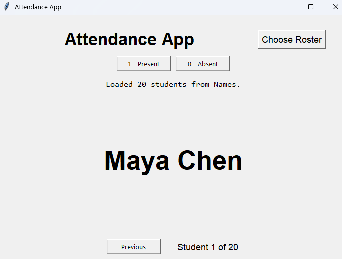

# Attendance App

A Python desktop application designed to streamline classroom attendance tracking.

## Screenshot

## What It Does

The application loads a class roster from an Excel file and displays students one at a time for attendance entry.

## Features

- Load a class roster from Excel
- Display students one at a time
- Record attendance with keyboard shortcuts
- Go back to correct the previous student
- Save attendance back to the roster
- Automatically create a column for today's date

## Attendance Controls

- `1` = Present
- `0` = Absent
- `-` = Present but not following

## How to Run

1. Create and activate a virtual environment
2. Install dependencies:

   pip install -r requirements.txt

3. Run:

   python attendance_app.py